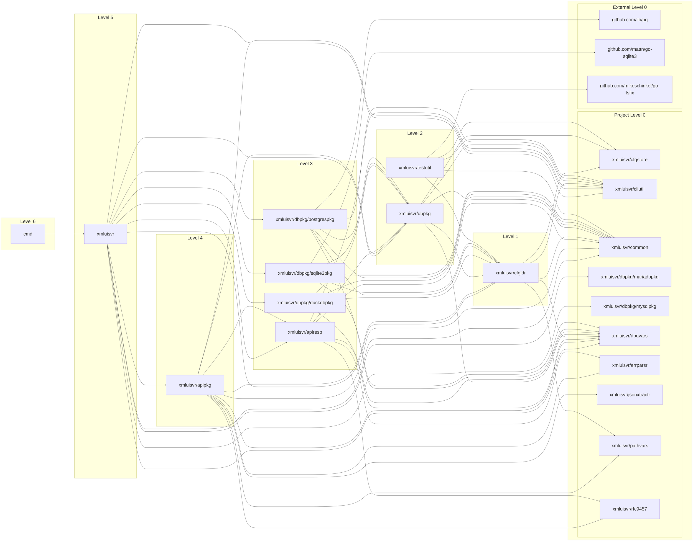

# xmlui-test-server

A lightweight HTTP server that:

- Serves static files from the current directory
- Provides a `/query` endpoint that sends SQL statements to a local SQLite database (data.db) or Postgres endpoint
- Provides a `/proxy` endpoint so JavaScript clients can use APIs that don't support CORS
- Supports loading SQLite extensions (on both macOS and Linux)

## Query Endpoint

```
curl -X POST http://localhost:8080/query \
  -H "Content-Type: application/json" \
  -d '{"sql": "SELECT ? as first, ? as second", "params": [1, "a"]}'
```

```
[{"first":1,"second":"a"}]
```

## Proxy Endpoint

```
GET /proxy/api.example.com/v1/data
```

This will proxy the request to `https://api.example.com/v1/data`


# Releases

The basic binary, without extension loading, is available in /releases in multiple flavors.

## Optional SQLite Extension Loading

The build scripts enhance the basic server with the ability to load SQLite extensions.

Key differences between the Linux and macOS ARM build scripts:

Linux (build-linux-amd.sh):
  - Builds a custom SQLite library with extension loading flags
  - Uses complex CGO linking against the custom SQLite (CGO_LDFLAGS="$SQLITE_INSTALL_DIR/lib/libsqlite3.a -lm 
  -ldl")
  - Downloads/builds sqlite-autoconf-3450200 with extension loading enabled
  - Creates a build directory structure

macOS ARM (build-macos-arm.sh):
  - Much simpler - relies entirely on the patched go-sqlite3
  - No custom SQLite build needed
  - Just sets basic CGO flags (CGO_CFLAGS="-DSQLITE_ENABLE_LOAD_EXTENSION -DSQLITE_ALLOW_LOAD_EXTENSION")
  - No custom linking required

Common elements:
  - Both require a patched go-sqlite3 with C.sqlite3_enable_load_extension(db, 1);
  - Both download the same Steampipe extension (platform-specific URLs)
  - Both use go build -tags "sqlite3_load_extension"
  - Both set the same CGO_CFLAGS for extension loading


```
--- a/sqlite3.go
+++ b/sqlite3.go
@@ -1477,6 +1477,8 @@ func (d *SQLiteDriver) Open(dsn string) (driver.Conn, error) {
                return nil, errors.New("sqlite succeeded without returning a database")
        }
 
+        C.sqlite3_enable_load_extension(db, 1);
+
        exec := func(s string) error {
                cs := C.CString(s)
                rv := C.sqlite3_exec(db, cs, nil, nil, nil)
```

Use the patched go-sqlite in go.mod for extension-enabled builds.

```
module xmlui-test-server

go 1.21.4

require (
	github.com/lib/pq v1.10.9
	github.com/mattn/go-sqlite3 v1.14.28
)

replace github.com/mattn/go-sqlite3 => ../go-sqlite3
```

The macOS ARM approach is much simpler because it doesn't need the custom SQLite build - the patched
go-sqlite3 is sufficient.

In the Go code, extensions are loaded with:

```go
	// Create memory database for extensions
	if _, err := db.Exec(`ATTACH DATABASE ':memory:' AS extension_mem`); err != nil {
		log.Printf("Failed to attach memory database: %v", err)
	}

	// Enable extension loading via PRAGMA
	if _, err := db.Exec(`PRAGMA load_extension = 1;`); err != nil {
		log.Printf("Warning: PRAGMA load_extension failed: %v", err)
	}

	// Get the absolute path to the extension file
	absPath, err := filepath.Abs(extensionPath)
	if err != nil {
		log.Printf("Warning: failed to get absolute path: %v", err)
		absPath = "./" + extensionPath
	}

	// Ensure file has execute permissions (required for Linux)
	if err := os.Chmod(absPath, 0755); err != nil {
		log.Printf("Warning: failed to set execute permissions on extension: %v", err)
	}

	// Log extension loading attempt
	log.Printf("Trying to load extension: %s", absPath)

	// Attempt to load the extension
	if _, err := db.Exec(`SELECT load_extension(?)`, absPath); err != nil {
		log.Printf("Extension loading failed: %v", err)
	} else {
		log.Println("Extension loaded successfully")
	}
```


## Running the Server

```bash
./xmlui-test-server
```

The server listens on port 8080 by default. You can specify a different port.

```bash
./xmlui-test-server --port 3000
```

You can use SQLite with a Steampipe extension.

```bash
./xmlui-test-server -extension steampipe-sqlite-mastodon.so
```

You can use an API description file, show db responses, and capture output to a log file

```bash
./xmlui-test-server --api api.json -show-responses | tee server_log.txt"
```
You can use Postgres instead of SQLite

```bash
./xmlui-test-server --api api.json --pg-conn postgres://steampipe@127.0.0.1:9193/steampipe
```

## Dependency Graph




| Package | Imported by | Direct imports | Indirect imports |
|---|---|---|---|
| cmd | — | xmluisvr | github.com/lib/pq<br>github.com/mattn/go-sqlite3<br>xmluisvr/apipkg<br>xmluisvr/apiresp<br>xmluisvr/cfgldr<br>xmluisvr/cfgstore<br>xmluisvr/cliutil<br>xmluisvr/common<br>xmluisvr/dbpkg<br>xmluisvr/dbpkg/duckdbpkg<br>xmluisvr/dbpkg/mariadbpkg<br>xmluisvr/dbpkg/mysqlpkg<br>xmluisvr/dbpkg/postgrespkg<br>xmluisvr/dbpkg/sqlite3pkg<br>xmluisvr/dbqvars<br>xmluisvr/errparsr<br>xmluisvr/jsonxtractr<br>xmluisvr/pathvars<br>xmluisvr/rfc9457 |
| xmluisvr | cmd | xmluisvr/apipkg<br>xmluisvr/apiresp<br>xmluisvr/cfgldr<br>xmluisvr/cliutil<br>xmluisvr/common<br>xmluisvr/dbpkg<br>xmluisvr/dbpkg/duckdbpkg<br>xmluisvr/dbpkg/mariadbpkg<br>xmluisvr/dbpkg/mysqlpkg<br>xmluisvr/dbpkg/postgrespkg<br>xmluisvr/dbpkg/sqlite3pkg<br>xmluisvr/dbqvars | github.com/lib/pq<br>github.com/mattn/go-sqlite3<br>xmluisvr/cfgstore<br>xmluisvr/errparsr<br>xmluisvr/jsonxtractr<br>xmluisvr/pathvars<br>xmluisvr/rfc9457 |
| xmluisvr/apipkg | xmluisvr | xmluisvr/apiresp<br>xmluisvr/cfgldr<br>xmluisvr/cliutil<br>xmluisvr/common<br>xmluisvr/dbpkg<br>xmluisvr/dbqvars<br>xmluisvr/errparsr<br>xmluisvr/jsonxtractr<br>xmluisvr/pathvars<br>xmluisvr/rfc9457 | xmluisvr/cfgstore |
| xmluisvr/apiresp | xmluisvr<br>xmluisvr/apipkg | xmluisvr/cliutil<br>xmluisvr/common<br>xmluisvr/dbpkg<br>xmluisvr/dbqvars<br>xmluisvr/errparsr<br>xmluisvr/rfc9457 | xmluisvr/cfgldr<br>xmluisvr/cfgstore<br>xmluisvr/pathvars |
| xmluisvr/cfgldr | xmluisvr<br>xmluisvr/apipkg<br>xmluisvr/dbpkg<br>xmluisvr/dbpkg/duckdbpkg<br>xmluisvr/dbpkg/postgrespkg<br>xmluisvr/dbpkg/sqlite3pkg<br>xmluisvr/testutil | xmluisvr/cfgstore<br>xmluisvr/cliutil<br>xmluisvr/common<br>xmluisvr/dbqvars<br>xmluisvr/pathvars | — |
| xmluisvr/cfgstore | xmluisvr/cfgldr<br>xmluisvr/dbpkg<br>xmluisvr/testutil | — | — |
| xmluisvr/cliutil | xmluisvr<br>xmluisvr/apipkg<br>xmluisvr/apiresp<br>xmluisvr/cfgldr<br>xmluisvr/dbpkg<br>xmluisvr/dbpkg/postgrespkg<br>xmluisvr/testutil | — | — |
| xmluisvr/common | xmluisvr<br>xmluisvr/apipkg<br>xmluisvr/apiresp<br>xmluisvr/cfgldr<br>xmluisvr/dbpkg<br>xmluisvr/dbpkg/duckdbpkg<br>xmluisvr/dbpkg/postgrespkg<br>xmluisvr/dbpkg/sqlite3pkg<br>xmluisvr/testutil | — | — |
| xmluisvr/dbpkg | xmluisvr<br>xmluisvr/apipkg<br>xmluisvr/apiresp<br>xmluisvr/dbpkg/duckdbpkg<br>xmluisvr/dbpkg/postgrespkg<br>xmluisvr/dbpkg/sqlite3pkg | xmluisvr/cfgldr<br>xmluisvr/cfgstore<br>xmluisvr/cliutil<br>xmluisvr/common<br>xmluisvr/dbqvars | xmluisvr/pathvars |
| xmluisvr/dbpkg/duckdbpkg | xmluisvr | xmluisvr/cfgldr<br>xmluisvr/common<br>xmluisvr/dbpkg<br>xmluisvr/dbqvars | xmluisvr/cfgstore<br>xmluisvr/cliutil<br>xmluisvr/pathvars |
| xmluisvr/dbpkg/mariadbpkg | xmluisvr | — | — |
| xmluisvr/dbpkg/mysqlpkg | xmluisvr | — | — |
| xmluisvr/dbpkg/postgrespkg | xmluisvr | github.com/lib/pq<br>xmluisvr/cfgldr<br>xmluisvr/cliutil<br>xmluisvr/common<br>xmluisvr/dbpkg<br>xmluisvr/dbqvars | xmluisvr/cfgstore<br>xmluisvr/pathvars |
| xmluisvr/dbpkg/sqlite3pkg | xmluisvr | github.com/mattn/go-sqlite3<br>xmluisvr/cfgldr<br>xmluisvr/common<br>xmluisvr/dbpkg<br>xmluisvr/dbqvars | xmluisvr/cfgstore<br>xmluisvr/cliutil<br>xmluisvr/pathvars |
| xmluisvr/dbqvars | xmluisvr<br>xmluisvr/apipkg<br>xmluisvr/apiresp<br>xmluisvr/cfgldr<br>xmluisvr/dbpkg<br>xmluisvr/dbpkg/duckdbpkg<br>xmluisvr/dbpkg/postgrespkg<br>xmluisvr/dbpkg/sqlite3pkg | — | — |
| xmluisvr/errparsr | xmluisvr/apipkg<br>xmluisvr/apiresp | — | — |
| xmluisvr/jsonxtractr | xmluisvr/apipkg | — | — |
| xmluisvr/pathvars | xmluisvr/apipkg<br>xmluisvr/cfgldr | — | — |
| xmluisvr/rfc9457 | xmluisvr/apipkg<br>xmluisvr/apiresp | — | — |
| xmluisvr/testutil | — | github.com/mikeschinkel/go-fsfix<br>xmluisvr/cfgldr<br>xmluisvr/cfgstore<br>xmluisvr/cliutil<br>xmluisvr/common | xmluisvr/dbqvars<br>xmluisvr/pathvars |

